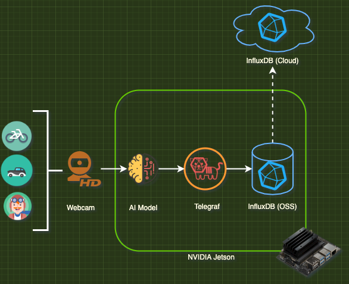

# Jetson Series Part 2: Vision AI Pipeline

This tutorial will show you how to setup and configure your own Vision AI solution using [DeepStream](https://developer.nvidia.com/deepstream-sdk), [Telegraf](https://github.com/influxdata/telegraf) and [InfluxDB](https://github.com/influxdata/influxdb). 

**The goal:**

## Things you will need

 1. [ ] Jetson Device
 2. [ ] Web Cam
 3. [ ] Complete [part 1](https://www.influxdata.com/blog/nvidia-jetson-series-part-1-jetson-stats/) of the tutorial
 4. [ ] DeepStream 5.1 [installed](https://docs.nvidia.com/metropolis/deepstream/5.1/dev-guide/text/DS_Quickstart.html)
 5. [ ] InfluxDB OSS installed on your Jetson [(Ubuntu - ARM64)](https://portal.influxdata.com/downloads/)
 6. [ ] Mosquitto MQTT Broker (See **Setup**)

## Background
Please follow my blog  [here](https://www.influxdata.com/blog/nvidia-jetson-series-part-1-jetson-stats/)

 ## Setup
 *Note: This setup guide will provided you with the needed steps to run the tutorial. Please check out the blog located under **Background** for a deeper understanding of the architecture.* 
### DeepStream
 1. Clone the the project repository to your Jetson device: 	
`https://github.com/InfluxCommunity/jetson_series_vision_pipeline`
 2. Install the pip requriments for the project: 
	 `python3 -m pip install -r requirements.txt`

### MQTT Broker
1. Update your apt repositry and then install the Mosquitto Broker: 
	`sudo apt update && sudo apt install -y mosquitto`
2. (Optional) Enable the Mosquitto Broker to start on boot: 
	`sudo systemctl enable mosquitto`
3. Start the Mosquitto Broker:
    `sudo systemctl start mosquitto`

### InfluxDB OSS

 1. Install InfluxDB OSS onto the Jetson and [complete setup](https://docs.influxdata.com/influxdb/v2.1/install/?t=Linux#set-up-influxdb). 
 2. [Import](https://docs.influxdata.com/influxdb/v2.1/influxdb-templates/use/) both templates into InfluxDB OSS: [Jetson_Stats](https://raw.githubusercontent.com/Jayclifford345/community-templates/jetson-stats/jetson_stats/jetson-stats.yml) & [Inference_Template](https://raw.githubusercontent.com/InfluxCommunity/jetson_series_vision_pipeline/master/Influx/Telegraf/Inference_Template.yml)

### Telegraf

 1. Update the following plugins:
	 - influxdb_v2 (edge_jetson_stats): Add token (OSS)
	 - influxdb_v2 (edge_inference): Add token (OSS)
	 - influxdb_v2 (cloud_jetson_stats): Add token (Cloud)
2. Move the file to the telegraf directory: 
`sudo mv telegraf.conf /etc/telegraf/telegraf.conf`
3. Restart the telegraf service. **Note make sure your InfluxDB Instance is ready:**
 `sudo systemctl restart telegraf`

## Running

    python3 main.py /dev/video0

## Contributing

Pull requests are welcome. For major changes, please open an issue first to discuss what you would like to change.

Please make sure to update tests as appropriate.
